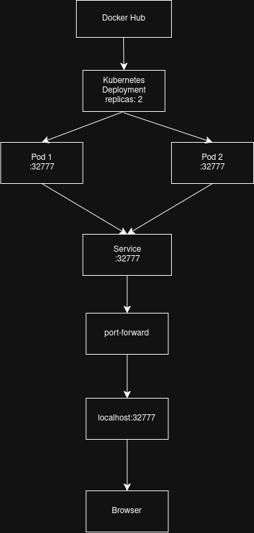
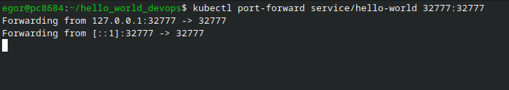
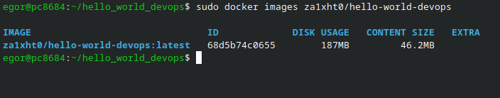

# Веб приложение “hello world” на python, которое должно работать на порту 32777

Стек: 
-Python 
-Docker
-Kubernetes
-Minikube

## Результат работы 
### Схема организации контейнеров и сервисов

### Скриншоты результатов работы в репозитории

Kubernetes pods

Kubernetes Service

port-forward

Browser

Docker

